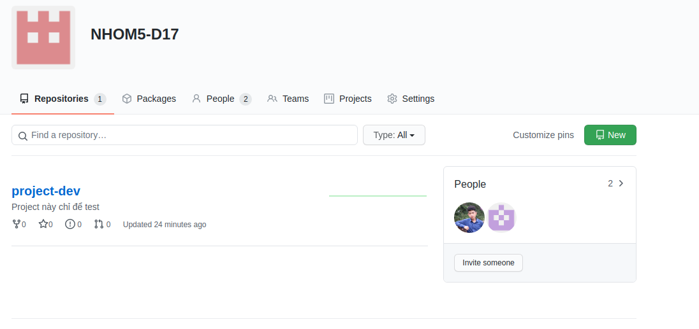

Hướng dẫn sử dụng github organization
=== 

> Điều kiện tiên quyết: Đã cài git  
> Đã vào được nhóm lớp của mình trên git 

[Bạn nào chưa cài git, chưa dùng git bao giờ vào link này để đọc qua về nó nhé](https://backlog.com/git-tutorial/vn/intro/intro2_1.html)

Ở trên web, sau khi vào nhóm của mình, trên github sẽ hiện ra giao diện trông giống như: 



Chúng ta sẽ click vào chữ **New** ở góc bên phải màn hình để tạo 1 kho lưu trữ cho riêng mình, và điền thông tin cần thiết như: 

* Repository name 

 

Sau khi ấn vào **Create repository** chúng ta sẽ tạo được 1 kho lưu trữ `rỗng` trên server trông giống như: 

 

Ở trên máy tính, tại thư mục chứa project các bản mở git lên: 

* Mở git đối với window: 

 

* Mở git đối với ubuntu (linux nói chung): 
 
  * Tại thư mục, click chuột phải chọn: **Open in Terminal** 

Sau khi mở terminal, chúng ta sử dụng lệnh: 

```shell script
pwd
```
để xem đang ở đúng thư mục (tương ứng với repo trên server) mà chúng ta cần đẩy code lên không 

```text
/home/tuannd/Desktop/Bai1_Android
```

Ở đây, thư mục cần đẩy lên của mình **Bai1_Android** (Tên thư mục yêu cầu viết liền và không chứa dấu, ký tự đặc biệt)

Sau khi xác nhận chính xác thư mục cần đẩy lên git, chúng ta thực hiện các câu lệnh sau: 

> Yêu cầu: đã đăng nhập git 

[Bạn nào chưa login vào git truy cập vào link này](https://backlog.com/git-tutorial/vn/intro/intro2_2.html)

```shell script
# Dòng có dấu # là dòng comment nha các bạn

# Khởi tạo project sử dụng git
git init 

# Thêm tất cả các file trong thư mục hiện tại vào repo trên local
# Trước khi sử dụng lệnh này, các bạn nên tham khảo: "gitignore file for java" để loại bỏ các file không cần thiết 
# giúp upload nhanh hơn một chút 
git add .

# Commit "Nội dung". Ex: Init project, Fix abcxyz
git commit -m "Init project"

# Cái link này nó có ở bước "Create repository", chúng ta sẽ copy link đấy và dán vào terminal (linux), Git Bash (Window)
# Còn đây là link của mình, các bạn đừng copy cái này nha =)) 
git remote add origin https://github.com/NHOM5-D17/Bai1_Android.git

# Push lên git trên server
git push -u origin master
```


